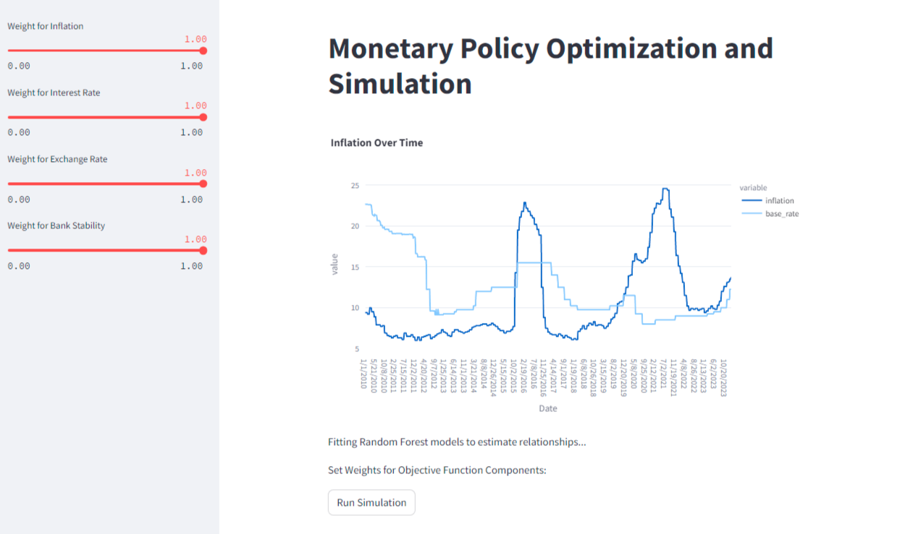

# Monetary Policy Optimization and 

This app enables users to optimize monetary policy and simulate its effects using machine learning and simulation techniques.

## Description
The app loads historical economic data, including interest rates, exchange rates, and inflation rates. It uses this data to train machine learning models, specifically Random Forest regressors, to estimate the relationships between various economic factors. Users can then adjust the weights assigned to different factors in the objective function to optimize monetary policy according to their preferences. The app also provides a simulation feature that allows users to simulate the effects of their chosen policy over time.

## Features
Data Loading: Loads historical economic data from a CSV file.
Visualization: Visualizes inflation rates over time using Plotly.
Model Training: Trains Random Forest regressors to estimate relationships between economic factors.
Optimization: Allows users to optimize monetary policy by adjusting weights for different factors in the objective function.
Simulation: Provides a simulation feature to visualize the effects of the chosen policy over time.
